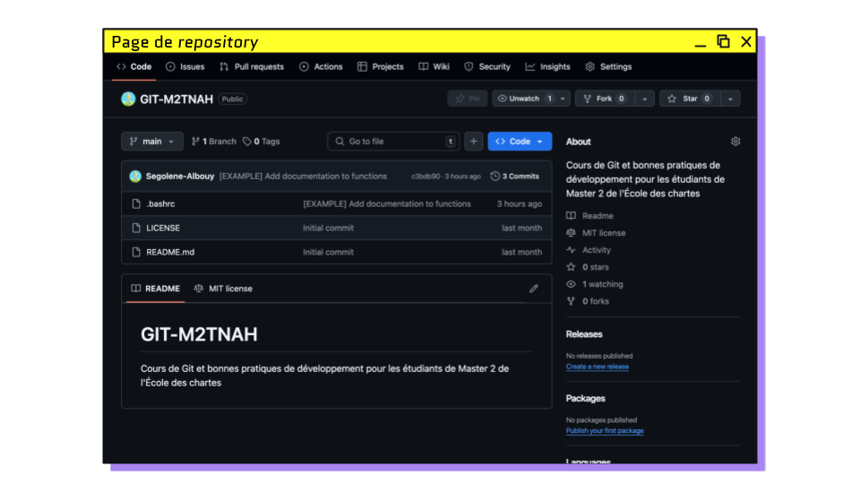
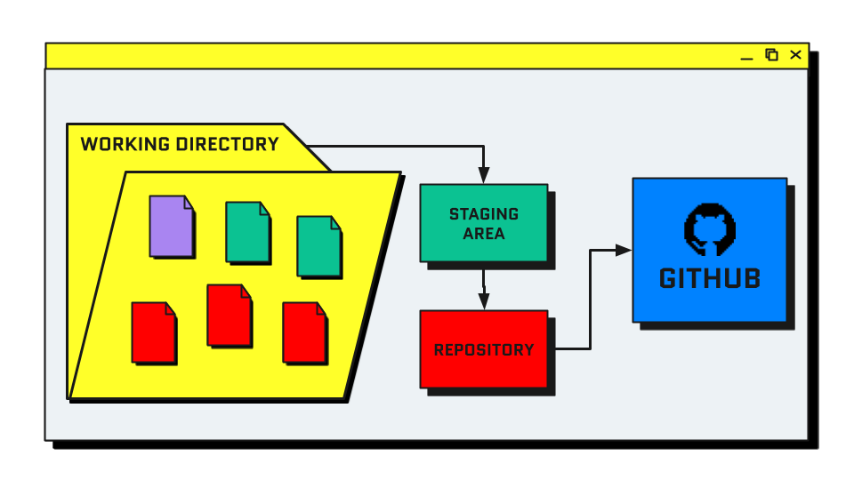
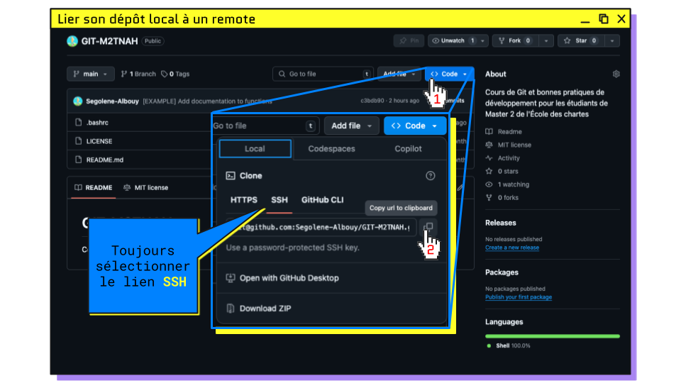
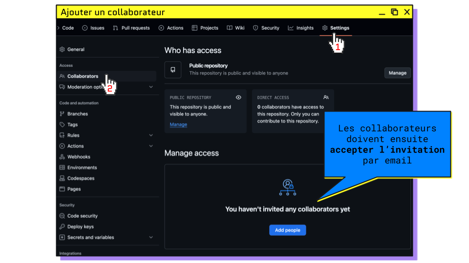

# LES BASES DE GIT

## Plan du cours

> 1. [Git](#git) : Comment & pourquoi utiliser le _versioning_
> 2. [IDE](#utiliser-un-ide) : Prise en main d’un logiciel de développement
> 3. [GitHub](#github) : Hébergement et collaboration
> 4. [Exercices](#exercice-4--contribuer-à-plusieurs-sur-un-_repository_-par-2) : Mise en pratique des commandes

## Git

> **GIT ?!**

`git` est un outil de gestion de versions décentralisé créé par Linus Torvald 
(le même que Linux) en 2005 sous licence open-source GPL

<hr>

### À quoi ça sert le _versioning_ ?

1. **_Sauvegarder des versions_** : Git permet de créer des instantanés du contenu d’un dossier
2. **_Conserver un historique_** : En sauvegardant des versions successives, on a accès à la liste de toutes les modifications
3. **_Créer des états parallèles_** : Possibilité de disposer de plusieurs versions simultanées d’un dossier
4. **_Collaborer sur un projet_** : Les contributions effectuées sur un même fichier peuvent être fusionnées

<hr>

#### 1️⃣ Sauvegarder des versions


Avec git, en plus de sauvegarder normalement vos fichiers, vous pouvez décider de **capturer des états donnés** d’un de vos dossiers.

Un dossier dont vous enregistrez des versions se nomme _**`repository`**_.

Une sauvegarde de ce repository est nommée _**`commit`**_.

<hr>

#### 2️⃣ Conserver un historique


Chaque _**`commit`**_ conserve en mémoire :

- sa date de création
- les lignes précises où les fichiers ont été édités
- un message expliquant le but des modifications
- la personne qui l’a effectué

En remontant les _commits_ successifs, il est possible de suivre précisément l’évolution d’un _repository_ et de revenir à un état précédent au besoin.

<hr>

#### 3️⃣ Créer des états parallèles


Il est possible de faire coexister différentes versions des fichiers contenus dans un _repository_ :
ces versions sont appelées _**`branches`**_.

Les _**`branches`**_ permettent de faire cohabiter de multiples états d’avancement d’un projet et 
de se lancer dans des modifications sans casser l’existant.

La branche par défaut s’appelle _**`main`**_ (anciennement _**`master`**_).

<hr>

#### 4️⃣ Collaborer sur un projet

Comme système de version décentralisé, `git` permet de :

- travailler sur un même projet avec plusieurs personnes, chacun depuis son ordinateur
- réconcilier les historiques pour mettre en commun les modifications effectuées sur différentes _**`branches`**_.

Les _**`branches`**_ peuvent ensuite être fusionnées : 
on parle de _**`merge`**_ ou de _**`rebase`**_.

<hr>

### Exercice 1 : Initialiser `git`

**Initialisation de git**
```bash
# Ouvrir son terminal (Ctrl+Alt+T sur Ubuntu)

# Mise à jour des dépendances système
sudo apt-get update

# Installation de git
sudo apt install git
```

[Correction](https://github.com/Segolene-Albouy/GIT-M2TNAH/blob/main/01-Git_basics/exercices/exercice1.sh)

<hr>

**Configuration de l’utilisateur Git**

```bash
# Définition de l’utilisateur (⚠️ même que sur GitHub)
git config --global user.name "<github-user>"
git config --global user.email "<github-email>"

# Par exemple (⚠️ retirer les chevrons)
git config --global user.name "Segolene-Albouy"
git config --global user.email "segolene.abouy@gmail.com"

# Nous verrons plus tard comment lier son compte Git local avec son compte GitHub

# ⚠️ À REFAIRE À POUR CHAQUE NOUVEL ORDINATEUR
```

<hr>

**Configuration de git**

```bash
# Définition de l’éditeur de par défaut
git config --global core.editor "nano"

# Définition du nom de la branche de par défaut
git config --global init.defaultBranch main

# Configuration de la coloration par défaut
git config --global color.ui auto

# Choix de merge comme mode de fusion lors d’un pull
git config --global pull.rebase false

# Afficher vos configurations
git config --list
```

<hr>

### Création de son premier commit


**Initialiser un repository**
```bash
# Se déplacer dans le dossier où créer le repo
cd <directory-name>

# Initialiser le repository
git init

# Afficher le contenu du dossier
ls -al

# → un dossier .git/ caché a été créé
```

<hr>

#### Processus de commit

La création d’un commit, se fait en plusieurs étapes :

1. **Modification des fichiers** : Ajout/suppression de fichiers, changement du contenu, renommage, etc.
2. **Choix des fichiers** : Sélection des fichiers à inclure dans le commit pour les ajouter à la **_staging area_**
3. **Création de la sauvegarde** : Enregistrement effectif de l’état des fichiers dans le _commit_

 Staging area > Commit">

<hr>

#### Ajout à la _staging area_ : `git status` et `git add`


On parle aussi d'indexation de fichiers.

```bash
# lister tous les fichiers modifiés depuis le dernier commit
git status

# ajout d’un fichier précis
git add <path/to/filename>
# ajout de plusieurs fichiers
git add <path/to/filename1> <path/to/filename2>
# ajout de tous les fichiers d’un dossier
git add <path/to/directory>

# ajout de tous les fichiers du repo
git add -A
```

<hr>

Exemple :
```bash
$ git status
Sur la branche main

# FICHIERS QUI ONT ÉTÉ INDEXÉS ("ADDÉS")
Modifications qui seront validées :
  (utilisez "git rm --cached <fichier>..." pour désindexer)
	nouveau fichier : fichier1.txt
	nouveau fichier : fichier2.txt

# FICHIERS MODIFIÉS MAIS NON INDEXÉS
Fichiers non suivis:
  (utilisez "git add <fichier>..." pour inclure dans ce qui sera validé)
	fichier3.txt
	fichier4.txt
```

<hr>

#### Visualiser les modifications : `git diff`

```bash
# voir le contenu des modifications depuis le dernier commit
git diff
# dans un fichier particulier
git diff <path/to/file>

# avec une autre branche
git diff <branch-name>
# entre deux branches
git diff <branch-name> <branch-name>
```

<hr>

Exemple :
```bash
$ git diff

diff --git a/fichier1.txt b/fichier1.txt # Développement des fichiers comparés

index 04af84e..c006980 100644            # hash des versions

--- a/fichier1.txt                       # Fichier avant modification
+++ b/fichier1.txt                       # Fichier après modification

@@ -1 +1 @@                              # Ligne affectée par le changement

-Bonjour, vous allez-bien ?              # Ligne avant modification
+Salut, tu vas bien ?                    # Ligne après modification
```

<hr>

#### Concevoir un bon commit


Après avoir utilisé `git diff` pour avoir en tête toutes les modifications, on peut créer le commit.
Pour faire un bon commit :

1. **Le bon moment** : Commiter lorsqu’on a achevé une modification significative. Privilégier les petits commits.
2. **Le bon contenu** : Ne commiter que les fichiers pertinents, si on a entamé plusieurs chantiers, les commiter un par un
3. **Le bon message** : Chaque commit est documenté avec un message résumant les modifications : il doit être explicite et concis

<hr>

**Le message de commit parfait**

> #### `[type] (scope) description`

L’idée, c'est de pouvoir identifier rapidement l’objet du commit :

- **`type`** : catégorie de la modification 
  - `[refacto]` pour le nettoyage de code,
  - `[fix] `pour les résolutions de bugs, 
  - `[update]` pour les modifications
  - `[feature]` pour les ajouts de fonctionnalités
  - `[doc]` pour la documentation
- **`scope`** : partie du projet impactée (optionnel), e.g. `(api)`, `(login)`, `(database)`, `(search)`, etc.
- **`description`** : court résumé des modifications effectuées (max 1 phrase)

💭 Pensez à votre vous du futur : est-ce que je vais encore me comprendre dans 6 mois ?

<hr>

#### Création du commit : `git commit`

```bash
# commit des fichiers de la staging area
git commit

# commit avec message
git commit -m "<commit-message>"
```

<hr>

**🚨ALERTE : oubli du `-m` après `commit` !**

Lorsque on ne précise pas directement le message avec l'argument `-m`, 
git ouvre l'éditeur de texte du terminal pour y écrire le message.

```
ÉCRIRE VOTRE MESSAGE ICI
# Veuillez saisir le message de validation pour vos modifications. Les lignes
# commençant par '#' seront ignorées, et un message vide abandonne la validation.
#
# Sur la branche main
# Votre branche est à jour avec 'origin/main'.
#
# Modifications qui seront validées :
#       modifié :         added_file.txt
#
# Fichiers non suivis:
#       other_file_that_was_not_added.txt
```

1. Sur **nano** (éditeur défini par défaut plus haut)
   1. Écrire le message de commit
   2. Enregistrer avec `Ctrl+S`
   3. Quitter avec `Ctrl+X`
2. Sur **vim** (c'est normal de paniquer la première fois)
   1. Appuyer sur `i` pour passer en mode édition
   2. Écrire le message de commit
   3. Appuyer sur `Esc` pour quitter le mode édition
   4. Taper `:x!` pour enregistrer et quitter ou `:q!` pour quitter sans enregistrer

<hr>

### Exercice 2 : Pratiquer les commandes de bases

**Créer un repository > Ajouter 3 fichiers > Effectuer 3 commits**
```md
1. Créer un dossier et l'ouvrir dans le terminal
2. Initialiser un repository git dans le dossier
3. Créer 3 fichiers `.txt` contenant du texte
4. Lister les fichiers modifiés et inspecter les changements
5. Ajouter les fichiers un par un à la staging area
6. Effectuer un commit pour chaque fichier ajouté avec un message explicite
```

[Correction](https://github.com/Segolene-Albouy/GIT-M2TNAH/blob/main/01-Git_basics/exercices/exercice2.sh)

<hr>

#### Historique des commits : `git log`


```bash
# affichage de l’historique in extenso
git log

# historique compact (récent en haut)
git log -oneline

# graphe de l’historique
git log -oneline --graph

# quitter avec q
```

<hr>

#### Création d'une branche : `git switch -c <branch-name>`


La nouvelle branche est une copie de la branche depuis laquelle on l’a créée.
Il n’est donc pas possible de créer une branche à partir d’une où aucun commit m’a été effectué.

```bash
# affiche les branches existantes
git branch
# crée une branche nommée <branch-name>
git branch <branch-name>
# change la branche courante
git switch <branch-name>

# crée + change de branche
git switch -c <branch-name>

# ancienne façon de faire
git checkout -b <branch-name>
```

<hr>

#### Modification du `.bashrc`

Le `.bashrc` est un fichier de configuration qui permet de personnaliser son terminal bash.

```bash
# ajout de commandes et alias à sa config bash
curl -s https://raw.githubusercontent.com/Segolene-Albouy/GIT-M2TNAH/refs/heads/main/01-Git_basics/templates/.bashrc >> ~/.bashrc

# recharger la config pour voir les effets
source ~/.bashrc

# rétablir le .bashrc d'origine
curl -s https://gist.githubusercontent.com/marioBonales/1637696/raw/93a33aa5f1893f46773483250214f8b8b496a270/.bashrc > ~/.bashrc
```

Avec l'ajout de ces commandes, vous pouvez désormais :

```bash
# Voir immédiatement la branche courante
user:/path/to/repo [branch] $ 

# Changer votre .bashrc facilement avec la commande
# Notamment pour changer les couleurs 🎨
bashrc

# Visualiser la diff entre la branche locale/remote
gdiff

# Afficher les logs bien formatés
glog
```
<hr>

## Utiliser un IDE

### Qu'est-ce qu'un IDE ?
Un IDE (_Integrated Development Environment_) est un logiciel qui facilite le développement de code :
- éditeur de texte avec coloration syntaxique
- terminal intégré
- navigation dans les fichiers
- plugins pour ajouter des fonctionnalités
- etc.


Nous utiliserons [VSCode](https://code.visualstudio.com/) ou [VSCodium](https://vscodium.com/) .

<hr>

#### Extensions
Dans le menu extensions, vous pouvez installer des plugins pour étendre les fonctionnalités de votre IDE.
Par exemple :

- **GitLens** : pour visualiser l’historique des fichiers (installé par défaut)
- **Python** : pour le support du langage Python (installé par défaut)
- [**Pyright**](https://marketplace.visualstudio.com/items?itemName=ms-pyright.pyright) : pour l’analyse de code en Python
- [**Pylance**](https://marketplace.visualstudio.com/items?itemName=ms-python.vscode-pylance) : pour l’analyse de code en Python (sur VSCode seulement)
- [**Jupyter**](https://marketplace.visualstudio.com/items?itemName=ms-toolsai.jupyter) : fonctionnalités Jupyter
- [**Git History**](https://marketplace.visualstudio.com/items?itemName=donjayamanne.githistory) : fonctionnalités avancées pour Git
- [**Better comments**](https://marketplace.visualstudio.com/items?itemName=aaron-bond.better-comments) : lisibilité des commentaires dans le code
- ...

<hr>

#### Raccourcis clavier infiniment utiles

Ouvrir le menu des _Keyboard Shortcuts_ : `Ctrl+K Ctrl+S`

| Defaut                    | Alt      | Action                                                  | Denomination                       |
|---------------------------|----------|---------------------------------------------------------|------------------------------------|
| `Ctrl+D`                  |          | Sélectionner la prochaine occurrence du mot sélectionné | _Add Selection To Next Find Match_ |
| `Shift+Ctrl+K`            | `Ctrl+E` | Supprimer la ligne courante                             | _Delete Line_                      |
| `Ctrl+/`<br>`Shift+Alt+A` | `Ctrl+"` | Commenter/décommenter la sélection                      | _Toggle block/Line comment_        |

[//]: # (| `Ctrl+Shift+L`         | `Ctrl+Shift+D` | Sélectionner toutes les occurrences du mot sélectionné  | _Select All Occurrences_           |)

<hr>

### La fusion de branches

Il existe deux façons de fusionner des branches :

| Merge                                                     | Rebase                                                                     |
|-----------------------------------------------------------|----------------------------------------------------------------------------|
| Fusion sans réécriture de l’historique                    | Réécriture de l'historique : commits déplacés sur une autre branche (base) |
| Résolution des conflits en une seule fois                 | Résolution des conflits commit après commit                                |
| Génère un commit de merge qui rassemble les modifications | Historique linéaire sans commit de merge                                   |

<hr>

#### Fusion avec `git merge <branch-name>`


Merge crée un nouveau commit de fusion qui combine deux branches.
Ce commit possède deux parents et préserve l'historique complet des deux branches.
Tous les conflits éventuels sont résolus une seule fois dans ce commit de merge.

```bash
# merge de main dans my-branch
[my-branch] git merge main
```

<hr>

#### Réécriture avec `git rebase <branch-name>`


Rebase réécrit l'historique en déplaçant les commits de la branche courante sur autre branche (nouvelle base).
Chaque commit est recréé un par un, comme si les modifications avaient été faites directement après les derniers commits de la branche base.
Les conflits éventuels sont résolus séparément pour chaque commit recréé.

```bash
# rebase de main dans my-branch
[my-branch] git rebase main

# main = branche de base / my-branch = branche rebasée
# les commits de my-branch sont réécrits sur main
```

<hr>

#### ⚠️ À retenir lors de la fusion

Quand on veut intégrer ses modifications à une autre branche (`main` dans cet exemple) :

1. On s'assure que l'autre branche est à jour
   ```bash
   git switch main
   [main] git pull
   ```
2. Depuis **sa branche** de travail, on fusionne l'autre branche 
   ```bash
   [main] git switch my-branch
   [my-branch] git merge/rebase main
   ```
3. Depuis **l'autre branche**, on `merge` sa branche de travail
   ```bash
   [my-branch] git switch main
   [main] git merge my-branch
   ```

🚨️ On ne **rebase JAMAIS** depuis une branche où on travaille à plusieurs.
🛟 De manière générale, préférer `merge` pour s'épargner des sueurs froides.

[//]: # (> **Pourquoi fusionner main dans sa branche AVANT de merger ?**)
[//]: # (> _Scénario : d'autres commits ont été `main` pendant que tu travaillais sur ta branche_)
[//]: # (> )
[//]: # (> Merge directement dans `main` :)
[//]: # (> - Les conflits apparaissent sur `main` &#40;branche partagée&#41;)
[//]: # (> - Ton code n'a jamais été testé avec les dernières modifications de `main`)
[//]: # (> - Si ça casse, c'est `main` qui est cassée &#40;impact sur toute l'équipe&#41;)
[//]: # (> )
[//]: # (> Fusionner `main` dans ta branche d'abord :)
[//]: # (> - Les conflits apparaissent sur ta branche)
[//]: # (> - Tu les résous tranquillement)
[//]: # (> - Tu testes que tout fonctionne encore, personne d'autre n'est impacté)
[//]: # (> )
[//]: # (> Quand tu merges dans `main`, les conflits sont déjà résolus ! )
[//]: # (> &#40;en particulier utile pour les _pull requests_ que nous verrons plus tard&#41;)

<hr>

#### Exercice 3 : Effectuer un merge sur VSCode

1. Ouvrir son _repository_ dans VSCode
2. Créer une branche et s’y déplacer
3. Modifier le contenu de certains fichiers
4. Depuis le terminal intégré, commiter ses modifications
5. Fusionner main dans sa branche

[Correction](./exercices/exercice3.sh)

<hr>

### Les conflits

Lorsque les deux branches à fusionner comportent des modifications sur les mêmes lignes de code, 
il est nécessaire de choisir manuellement quelle modification doit être conservée.

```bash
# Création d’un fichier et commit
[main] echo "Hello world!" > hello.txt
[main] git commit -am “Hello file creation”

# Modification du fichier dans une branche
[main] git switch -c branch
[branch] echo "Hello from branch!" > hello.txt
[branch] git commit -am “Hello file modif”

# Modification du fichier dans une autre branche
[branch] git switch -c main
[main] echo "Hello from main!" > hello.txt
[main] git commit -am “Hello file update”

[main] git merge branch # CONFLIT ⛔️ 
```

<hr>

#### Résolution manuelle de conflits

1. Trouver les zones de code conflictuelles : recherche `<<<<<<<` dans la _codebase_
   ```python
   # HEAD correspond à la branche où vous êtes
   def hello():
   <<<<<<< HEAD
       print("Hello from my-branch!")
   =======
       print("Hello from other-branch!")
   >>>>>>> other-branch
   ```
2. Choisir quelle version conserver (ou faire un mix des deux)
   ```python
   # Résoudre un conflit revient à ne laisser qu’une version
   def hello():
       print("Hello from my-branch and other-branch!")
   ```
3. Finaliser le merge
   ```bash
   # Ajouter les fichiers modifiés à la staging area
   git add <path/to/file>
   # Finaliser le merge avec un commit, git génère automatiquement le message
   git commit
   # Ctrl+S pour enregistrer, Ctrl+X pour quitter
   ```

<hr>

#### Résolution de conflits avec le _Merge Editor_


1. Ouvrir _**Source Control**_ (`Ctrl+Shift+G`)
2. Pour chaque fichier en conflit sous "_Merge Changes_" :
   - Résoudre les conflits
   - Cliquer sur "_Complete Merge_" (`add` le fichier à la _staging area_)
3. Finaliser le merge avec "Continue" (`commit` avec le message généré par Git)

<hr>

## GitHub

Il existe différents services en ligne pour héberger ses _repositories_ :

- [GitHub](https://github.com) : option la plus répandue, sert de portfolio aux développeurs
- [GitLab](https://gitlab.com/) : très utilisé en entreprise, peut être hébergé sur des serveurs privés
- [Bitbucket](https://bitbucket.org) : version développée par Atlassian

<hr>

### Obtenir une licence étudiante GitHub

> #### Prérequis
> 1. Ajouter son adresse mail de l’École : [github.com/settings/emails](https://github.com/settings/emails)
> 2. Remplir son profil GitHub : [github.com/settings/profile](https://github.com/settings/profile)
> 3. Customiser son README : [github.com/<your-username>](https://github.com/<your-username>)
> 4. Renseigner ses infos bancaires : [github.com/settings/billing/payment_information](https://github.com/settings/billing/payment_information)
> 5. Activer la 2 factors Authentication 
>    - Par [SMS](https://docs.github.com/fr/authentication/securing-your-account-with-two-factor-authentication-2fa/configuring-two-factor-authentication#configuring-two-factor-authentication-using-text-messages) 
>    - Puis avec l’[app mobile](https://docs.github.com/fr/authentication/securing-your-account-with-two-factor-authentication-2fa/configuring-two-factor-authentication#configuration-de-lauthentification-%C3%A0-2facteurs-%C3%A0-laide-de-github-mobile)
> 
> #### Demande de la licence
> 1. Renseigner son institution [education.github.com/discount_requests/application](https://github.com/settings/education/benefits)
> 2. Prendre en photo sa carte étudiant
> 3. Attendre la validation
> 4. Installer le plugin copilot sur son IDE
> 5. Profiter de copilot gratuitement !

### Git vs GitHub

| Git                                                       | GitHub                                                    |
|-----------------------------------------------------------|-----------------------------------------------------------|
| Gestionnaire de versions                                  | Service d’hébergement en ligne                            |
| Outil local sur sa machine pour modifier ses repositories | Là où stocker et publier ses repositories                 |
| Ensemble de commandes disponibles dans le terminal        | Interface web pour visualiser et collaborer sur des repos |

<hr>

#### _Remote / local repository_

| Local                                                  | Remote                                                  |
|--------------------------------------------------------|---------------------------------------------------------|
|   |  |
| Dossier contenant le _repo_ situé sur votre ordinateur | Version en ligne du _repo_, à la manière d’un _drive_   |

Le _remote repository_ est une version du _repository_ (aussi désignée par `origin`) en ligne 
qui permet de centraliser l’historique et les modifications. 
Public ou privé, plusieurs collaborateurs peuvent y contribuer, avec différents droits.

<hr>

#### _Repository_ sur GitHub



Fichiers spéciaux du _repository_ :
- [`.gitignore`](./templates/.gitgnore) : liste des fichiers à ignorer par git
- [`README.md`](./templates/README.md) : documentation du projet, s'affiche sur la page principale du _repository_
- [`LICENSE`](http://choosealicense.com) : licence utilisée pour le code du projet

<hr>

### Processus de publication



<hr>

#### Authentifier son ordinateur pour GitHub

Pour publier du code sur GitHub, il faut configurer une authentification SSH.
Elle repose sur une paire de clés :
- La clé privée (secrète, sur l'ordinateur)
- La clé publique (partagée sur GitHub)

Lors d'envoi de code sur GitHub, l'ordinateur prouve qu'il possède la clé privée 
correspondant à la clé publique dont dispose GitHub.

1. Créer une clef SSH depuis le terminal
   ```bash
   # création de la paire de clefs
   ssh-keygen -t ed25519
   # afficher le contenu de la clef publique
   cat ~/.ssh/id_ed25519.pub
   ```
2. GitHub > Settings > SSH and GPG keys > [New](https://github.com/settings/ssh/new)
3. Coller la clef publique affichée dans votre terminal 
4. Nommer la clef pour désigner votre ordinateur

<hr>

#### Publier du code local sur GitHub : `git push`


```bash
git push
```

> **😰 Problème : Aucun dépôt distant !**
> ```bash
> $ git push
> fatal : Pas de destination pour pousser.
> Spécifiez une URL depuis la ligne de commande ou configurez un dépôt distant en utilisant
> 
>     git remote add <origin> <url>
> 
> et poussez alors en utilisant le dépôt distant
> 
>     git push <origin>
> ```

<hr>

#### Créer un _remote repository_ sur GitHub

Créer une nouveau repository sur [GitHub](https://github.com/new) puis copier le lien SSH.



<hr>

#### Lier son _local repository_ au _remote repository_ : `git remote add <url>`


```bash
# Lier son repo local à un repo distant
git remote add origin <url-repo-distant>

# Il est ensuite possible de publier son repo
git push
```

<hr>

#### Copier un _remote repository_ en local : `git clone <url>`


```bash
# Copier un repo distant sur son ordinateur
git clone <url-repo-distant>

# De manière générale, pour créer un nouveau projet, 
# on le crée sur GitHub, puis le clone en local

# Cloner le repository du cours
git clone git@github.com:Segolene-Albouy/GIT-M2TNAH.git
```

<hr>

#### 😭 GitHub veut pas m’autoriser à cloner le _repo_ !

On commence par lire le message de son terminal :

```bash
git@github.com: Permission denied (publickey).
fatal: Could not read from remote repository.

Please make sure you have the correct access rights and the repository exists
```

L'erreur peut être due à :
- **Compte git local mal configuré**
    ```bash
    # Vérifier dans sa config locale que user & email correspondent bien à ceux du compte GitHub
    git config --list
    
    # Si ce n’est pas le cas, corriger avec (⚠️ retirer les chevrons)
    git config --global user.name "<github-user>"
    git config --global user.email "<github-email>"
    ```
- **Clé SSH défectueuse**
    ```bash
    # Vérifier la config SSH avec GitHub
    ssh -T git@github.com
    
    # Afficher le contenu de la clef publique (en recréer une avec `ssh-keygen -t ed25519` si besoin)
    cat ~/.ssh/id_ed25519.pub
    
    # Copier la clef publique et la coller sur GitHub
    ```

<hr>

#### Cloner directement depuis VSCode

1. Ouvrir la Command palette `Ctrl+Shift+P`
2. Rechercher “Git clone” 
3. Connexion à GitHub 
4. Sélection du repository 
5. Choix de l’emplacement 
6. Ajout au Workspace

<hr>

#### Récupérer du code depuis le _repo_ distant : `git pull`


```bash
# récuperer du code depuis GitHub
git pull

# git pull est une forme de fusion de branches puisqu’on réunit le contenu d’une branche distante avec une branche locale

# récuperer du code depuis GitHub sans fusion
git fetch
```

<hr>

#### Ajouter un collaborateur à son _repository_



1. GitHub > Settings > Collaborators > Manage access
2. Les collaborateurs doivent ensuite accepter l’invitation reçue par email

<hr>

### Exercice 4 : Contribuer à plusieurs sur un _repository_ (par 2)

1. Un des deux crée un _repository_ sur GitHub
2. Il ajoute l’autre dans les collaborateurs
3. Chacun clone le _repository_ sur son ordinateur
4. Depuis son IDE, chacun effectue des commits sur la branche **main**
5. Chacun push ses commits sur le _repo_ distant

> _Que se passe-t-il ? Pourquoi ?_

<hr>

#### 😭 L’autre a réussi à _pusher_ mais moi ça marche paaaas !

On commence par lire le message de son terminal :

```bash
To github.com:utilisateur/nom-du-repo.git
 ! [rejected] <local> -> <remote> (fetch first)
error: failed to push some refs to '<remote>'
...
hint: (e.g., 'git pull ...') before pushing again.
```

> Il n’est pas possible de pusher ses modifications sans avoir auparavant intégré les commits déjà publiés sur le _remote_
> Pour mettre à jour sa version du code et pouvoir pusher, il faut d’abord `pull` le dépôt distant
> 
> ```bash
> To <remote> ! [rejected] <b> -> <b> (fetch first)
> error: failed to push some refs to '<remote>'
> ...
> 
> $ git pull
> ```

<hr>

#### 😭 GitHub veut pas m’autoriser à _pusher_ !

On commence par lire le message de son terminal :

```bash
remote: Support for password authentication was removed on August 13, 2021. Please use a personal access token instead.

fatal: Authentication failed for 'https://github.com/username/repo.git/'
```

> Lorsqu’on utilise le lien HTTPS pour cloner un _repository_, il n’est plus possible de publier son code.
> Il faut alors changer le remote pour utiliser **lien SSH** du _repository_
> 
> ```bash
> # Modifier l’URL du remote pour le lien SSH
> git remote set-url origin git@github.com:ssh.git
> ```

<hr>

### Exercice 4 : suite de l'exercice

1. _Pull_ de la branche `main` locale avec les modifs _remote_
2. Chacun crée une branche à partir de main
3. Chacun modifie **les mêmes bouts** de fichiers déjà existants
4. Chacun _push_ sa branche sur le _repo_ distant

> _Que se passe-t-il ? Pourquoi ?_

<hr>

#### Publier une nouvelle branche : `git push -u origin <branch-name>`

Lorsqu’une nouvelle branche est créée en local, il faut configurer une branche distante sur laquelle _pusher_.

```bash
$ git push

fatal : La branche courante <branch> n'a pas de branche amont.

Pour pousser la branche courante et définir la distante comme amont, utilisez

    git push --set-upstream origin <branch>
    
$ git push -u origin <branch>
```

<hr>

### Exercice 4 : fin de l'exercice

1. Récupérer la branche de l’autre en local
2. Changer de branche pour aller sur l’autre
3. Merger sa branche dans celle de l’autre
4. Ouvrir le fichier avec conflit sur l’IDE
5. Modifier le fichier pour ne conserver qu’une version des modifications
6. Finir le merge et publier le code sur GitHub

[Correction](./exercices/exercice4.sh)