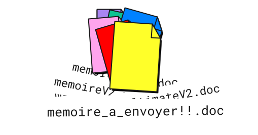
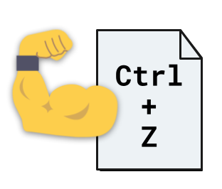
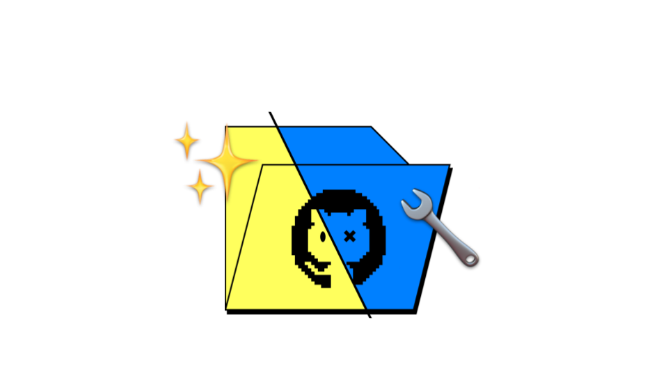
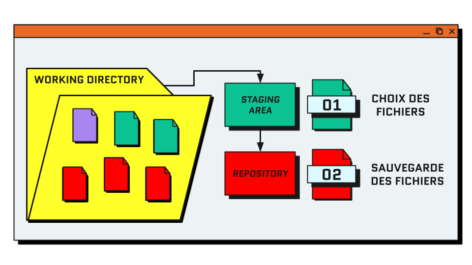
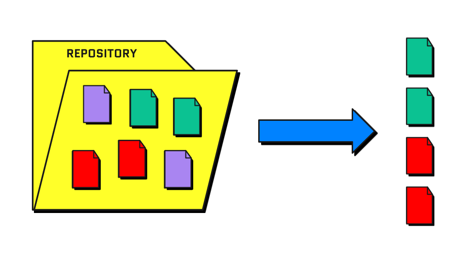
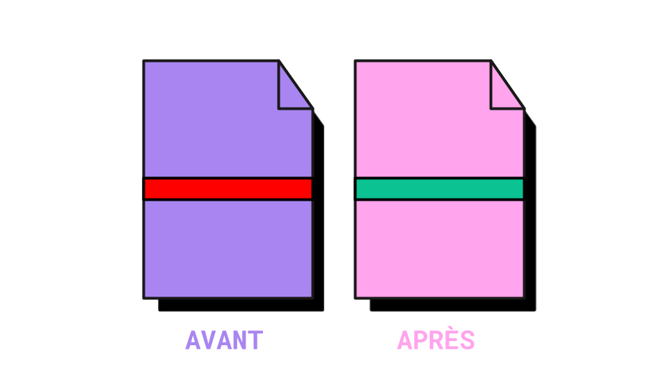
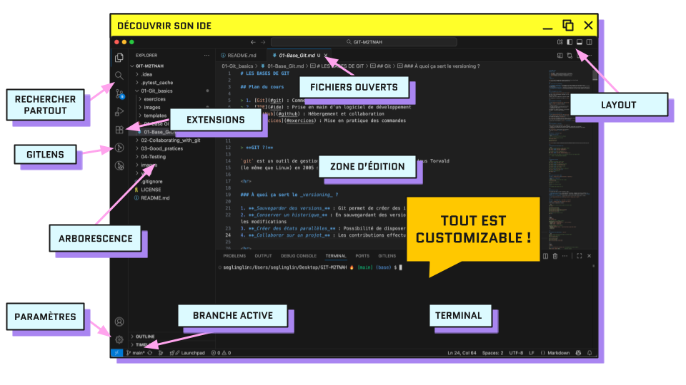
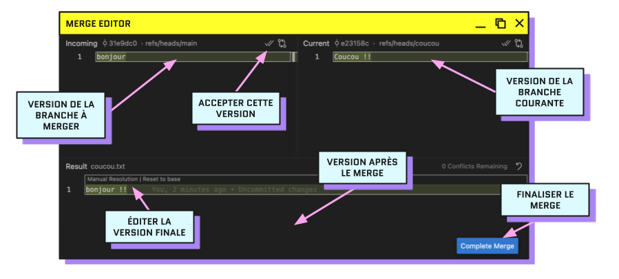

# LES BASES DE GIT

## Plan du cours

> 1. [Git](#git) : Comment & pourquoi utiliser le _versioning_
> 2. [IDE](#utiliser-un-ide) : Prise en main d’un logiciel de développement
> 3. [GitHub](#github) : Hébergement et collaboration

## Git

> **GIT ?!**

`git` est un outil de gestion de versions décentralisé créé par Linus Torvald 
(le même que Linux) en 2005 sous licence open-source GPL

<hr>

### À quoi ça sert le _versioning_ ?

1. **_Sauvegarder des versions_** : Git permet de créer des instantanés du contenu d’un dossier
2. **_Conserver un historique_** : En sauvegardant des versions successives, on a accès à la liste de toutes les modifications
3. **_Créer des états parallèles_** : Possibilité de disposer de plusieurs versions simultanées d’un dossier
4. **_Collaborer sur un projet_** : Les contributions effectuées sur un même fichier peuvent être fusionnées

<hr>

#### 1️⃣ Sauvegarder des versions



Avec git, en plus de sauvegarder normalement vos fichiers, vous pouvez décider de **capturer des états donnés** d’un de vos dossiers.

Un dossier dont vous enregistrez des versions se nomme _**`repository`**_.

Une sauvegarde de ce repository est nommée _**`commit`**_.

<hr>

#### 2️⃣ Conserver un historique



Chaque _**`commit`**_ conserve en mémoire :

- sa date de création
- les lignes précises où les fichiers ont été édités
- un message expliquant le but des modifications
- la personne qui l’a effectué

En remontant les _commits_ successifs, il est possible de suivre précisément l’évolution d’un _repository_ et de revenir à un état précédent au besoin.

<hr>

#### 3️⃣ Créer des états parallèles



Il est possible de faire coexister différentes versions des fichiers contenus dans un _repository_ :
ces versions sont appelées _**`branches`**_.

Les _**`branches`**_ permettent de faire cohabiter de multiples états d’avancement d’un projet et 
de se lancer dans des modifications sans casser l’existant.

La branche par défaut s’appelle _**`main`**_ (anciennement _**`master`**_).

<hr>

#### 4️⃣ Collaborer sur un projet


Comme système de version décentralisé, `git` permet de :

- travailler sur un même projet avec plusieurs personnes, chacun depuis son ordinateur
- réconcilier les historiques pour mettre en commun les modifications effectuées sur différentes _**`branches`**_.

Les _**`branches`**_ peuvent ensuite être fusionnées : 
on parle de _**`merge`**_ ou de _**`rebase`**_.

<hr>

### Exercice 1 : Initialiser `git`

**Initialisation de git**
```bash
# Ouvrir son terminal (Ctrl+Alt+T sur Ubuntu)

# Mise à jour des dépendances système
sudo apt-get update

# Installation de git
sudo apt install git
```

[Correction](https://github.com/Segolene-Albouy/GIT-M2TNAH/blob/main/01-Git_basics/exercices/exercice1.sh)

<hr>

**Configuration de l’utilisateur Git**

```bash
# Définition de l’utilisateur (⚠️ même que sur GitHub)
git config --global user.name "<github-user>"
git config --global user.email "<github-email>"

# Par exemple (⚠️ retirer les chevrons)
git config --global user.name "Segolene-Albouy"
git config --global user.email "segolene.abouy@gmail.com"

# Nous verrons plus tard comment lier son compte Git local avec son compte GitHub

# ⚠️ À REFAIRE À POUR CHAQUE NOUVEL ORDINATEUR
```

<hr>

**Configuration de git**

```bash
# Définition de l’éditeur de par défaut
git config --global core.editor "nano"

# Définition du nom de la branche de par défaut
git config --global init.defaultBranch main

# Configuration de la coloration par défaut
git config --global color.ui auto

# Choix de merge comme mode de fusion lors d’un pull
git config --global pull.rebase false

# Afficher vos configurations
git config --list
```

<hr>

#### Modification du `.bashrc`

Le `.bashrc` est un fichier de configuration qui permet de personnaliser son terminal bash.

```bash
# ajout de commandes et alias à sa config bash
curl -s https://raw.githubusercontent.com/Segolene-Albouy/GIT-M2TNAH/refs/heads/main/01-Git_basics/templates/.bashrc >> ~/.bashrc

# recharger la config pour voir les effets
source ~/.bashrc

# rétablir le .bashrc d'origine
curl -s https://gist.githubusercontent.com/marioBonales/1637696/raw/93a33aa5f1893f46773483250214f8b8b496a270/.bashrc > ~/.bashrc
```

Avec l'ajout de ces commandes, vous pouvez désormais :

```bash
# Voir immédiatement la branche courante
user:/path/to/repo [branch] $ 

# Changer votre .bashrc facilement avec la commande
# Notamment pour changer les couleurs 🎨
bashrc

# Visualiser la diff entre la branche locale/remote
gdiff

# Afficher les logs bien formatés
glog
```

<hr>

### Création de son premier commit


**Initialiser un repository**
```bash
# Se déplacer dans le dossier où créer le repo
cd <directory-name>

# Initialiser le repository
git init

# Afficher le contenu du dossier
ls -al

# → un dossier .git/ caché a été créé
```

<hr>

#### Processus de commit

La création d’un commit, se fait en plusieurs étapes :

1. **Modification des fichiers** : Ajout/suppression de fichiers, changement du contenu, renommage, etc.
2. **Choix des fichiers** : Sélection des fichiers à inclure dans le commit pour les ajouter à la **_staging area_**
3. **Création de la sauvegarde** : Enregistrement effectif de l’état des fichiers dans le _commit_

 Staging area > Commit">

<hr>

#### Connaître l'état du _repository_ : `git status`



Exemple :
```bash
$ git status
Sur la branche main

# FICHIERS QUI ONT ÉTÉ INDEXÉS ("ADDÉS")
Modifications qui seront validées :
  (utilisez "git rm --cached <fichier>..." pour désindexer)
	nouveau fichier : fichier1.txt
	nouveau fichier : fichier2.txt

# FICHIERS MODIFIÉS MAIS NON INDEXÉS
Fichiers non suivis:
  (utilisez "git add <fichier>..." pour inclure dans ce qui sera validé)
	fichier3.txt
	fichier4.txt
```

<hr>

#### Ajout à la _staging area_ : `git add`


On parle aussi d'indexation de fichiers.

```bash
# lister tous les fichiers modifiés depuis le dernier commit
git status

# ajout d’un fichier précis
git add <path/to/filename>
# ajout de plusieurs fichiers
git add <path/to/filename1> <path/to/filename2>
# ajout de tous les fichiers d’un dossier
git add <path/to/directory>

# ajout de tous les fichiers du repo
git add -A
```

> 🗒️ Note: git fonctionne mieux avec des fichiers texte brut, on évite `.docx`, `.odt`, etc.

<hr>

Exemple :
```bash
$ git diff

diff --git a/fichier1.txt b/fichier1.txt # Développement des fichiers comparés

index 04af84e..c006980 100644            # hash des versions

--- a/fichier1.txt                       # Fichier avant modification
+++ b/fichier1.txt                       # Fichier après modification

@@ -1 +1 @@                              # Ligne affectée par le changement

-Bonjour, vous allez-bien ?              # Ligne avant modification
+Salut, tu vas bien ?                    # Ligne après modification
```

<hr>

#### Concevoir un bon commit


```bash
# commit des fichiers de la staging area
git commit

# commit avec message
git commit -m "<commit-message>"
```

Pour faire un bon commit :

1. **Le bon moment** : Commiter lorsqu’on a achevé une modification significative. Privilégier les petits commits.
2. **Le bon contenu** : Ne commiter que les fichiers pertinents, si on a entamé plusieurs chantiers, les commiter un par un
3. **Le bon message** : Chaque commit est documenté avec un message résumant les modifications : il doit être explicite et concis

<hr>

**Le message de commit parfait**

> #### `[type] (scope) description`

L’idée, c'est de pouvoir identifier rapidement l’objet du commit :

- **`type`** : catégorie de la modification 
  - `[refacto]` pour le nettoyage de code,
  - `[fix] `pour les résolutions de bugs, 
  - `[update]` pour les modifications
  - `[feature]` pour les ajouts de fonctionnalités
  - `[doc]` pour la documentation
- **`scope`** : partie du projet impactée (optionnel), e.g. `(api)`, `(login)`, `(database)`, `(search)`, etc.
- **`description`** : court résumé des modifications effectuées (max 1 phrase)

> 💭 Pensez à votre vous du futur : est-ce que je vais encore me comprendre dans 6 mois ?

<hr>

**🚨ALERTE : oubli du `-m` après `commit` !**

Lorsqu'on ne précise pas directement le message avec l'argument `-m`, 
git ouvre l'éditeur de texte du terminal pour y écrire le message.

```
ÉCRIRE VOTRE MESSAGE ICI
# Veuillez saisir le message de validation pour vos modifications. Les lignes
# commençant par '#' seront ignorées, et un message vide abandonne la validation.
#
# Sur la branche main
# Votre branche est à jour avec 'origin/main'.
#
# Modifications qui seront validées :
#       modifié :         added_file.txt
#
# Fichiers non suivis:
#       other_file_that_was_not_added.txt
```

1. Sur **nano** (éditeur défini par défaut plus haut)
   1. Écrire le message de commit
   2. Enregistrer avec `Ctrl+S`
   3. Quitter avec `Ctrl+X`
2. Sur **vim** (c'est normal de paniquer la première fois)
   1. Appuyer sur `i` pour passer en mode édition
   2. Écrire le message de commit
   3. Appuyer sur `Esc` pour quitter le mode édition
   4. Taper `:x!` pour enregistrer et quitter ou `:q!` pour quitter sans enregistrer

<hr>

#### Visualiser les modifications : `git diff`



Permet de voir toutes les modifications effectuées depuis le dernier commit.
On utilise `git diff` pour avoir en tête toutes les modifications avant de créer le commit.

```bash
# voir le contenu des modifications depuis le dernier commit
git diff
# dans un fichier particulier
git diff <path/to/file>

# avec une autre branche
git diff <branch-name>
# entre deux branches
git diff <branch-name> <branch-name>
```

<hr>

### Exercice 2 : Pratiquer les commandes de bases

**Créer un repository > Ajouter 3 fichiers > Effectuer 3 commits**
```md
1. Créer un dossier et l'ouvrir dans le terminal
2. Initialiser un repository git dans le dossier
3. Créer 3 fichiers `.txt` contenant du texte
4. Lister les fichiers modifiés et inspecter les changements
5. Ajouter les fichiers un par un à la staging area
6. Effectuer un commit pour chaque fichier ajouté avec un message explicite
```

[Correction](https://github.com/Segolene-Albouy/GIT-M2TNAH/blob/main/01-Git_basics/exercices/exercice2.sh)

<hr>

#### Historique des commits : `git log`


```bash
# affichage de l’historique in extenso
git log

# historique compact (récent en haut)
git log -oneline

# graphe de l’historique
git log -oneline --graph

# quitter avec q
```

<hr>

#### Création d'une branche : `git switch -c <branch-name>`


La nouvelle branche est une copie de la branche depuis laquelle on l’a créée.
Il n’est donc pas possible de créer une branche à partir d’une où aucun commit m’a été effectué.

```bash
# affiche les branches existantes
git branch
# crée une branche nommée <branch-name>
git branch <branch-name>
# change la branche courante
git switch <branch-name>

# crée + change de branche
git switch -c <branch-name>

# ancienne façon de faire
git checkout -b <branch-name>
```

<hr>

## Utiliser un IDE

### Qu'est-ce qu'un IDE ?
Un IDE (_Integrated Development Environment_) est un logiciel qui facilite le développement de code :
- éditeur de texte avec coloration syntaxique
- terminal intégré
- navigation dans les fichiers
- plugins pour ajouter des fonctionnalités
- etc.



Nous utiliserons [VSCode](https://code.visualstudio.com/) ou [VSCodium](https://vscodium.com/) .

<hr>

#### Extensions
Dans le menu extensions, vous pouvez installer des plugins pour étendre les fonctionnalités de votre IDE.
Par exemple :

- **GitLens** : pour visualiser l’historique des fichiers (installé par défaut)
- **Python** : pour le support du langage Python (installé par défaut)
- [**Pyright**](https://marketplace.visualstudio.com/items?itemName=ms-pyright.pyright) : pour l’analyse de code en Python
- [**Pylance**](https://marketplace.visualstudio.com/items?itemName=ms-python.vscode-pylance) : pour l’analyse de code en Python (sur VSCode seulement)
- [**Jupyter**](https://marketplace.visualstudio.com/items?itemName=ms-toolsai.jupyter) : fonctionnalités Jupyter
- [**Git History**](https://marketplace.visualstudio.com/items?itemName=donjayamanne.githistory) : fonctionnalités avancées pour Git
- [**Better comments**](https://marketplace.visualstudio.com/items?itemName=aaron-bond.better-comments) : lisibilité des commentaires dans le code
- ...

<hr>

#### Raccourcis clavier infiniment utiles

Ouvrir le menu des _Keyboard Shortcuts_ : `Ctrl+K Ctrl+S`

| Defaut                    | Alt      | Action                                                  | Denomination                       |
|---------------------------|----------|---------------------------------------------------------|------------------------------------|
| `Ctrl+D`                  |          | Sélectionner la prochaine occurrence du mot sélectionné | _Add Selection To Next Find Match_ |
| `Shift+Ctrl+K`            | `Ctrl+E` | Supprimer la ligne courante                             | _Delete Line_                      |
| `Ctrl+/`<br>`Shift+Alt+A` | `Ctrl+"` | Commenter/décommenter la sélection                      | _Toggle block/Line comment_        |

[//]: # (| `Ctrl+Shift+L`         | `Ctrl+Shift+D` | Sélectionner toutes les occurrences du mot sélectionné  | _Select All Occurrences_           |)

<hr>

### La fusion de branches

Il existe deux façons de fusionner des branches :

| Merge                                                     | Rebase                                                                     |
|-----------------------------------------------------------|----------------------------------------------------------------------------|
| Fusion sans réécriture de l’historique                    | Réécriture de l'historique : commits déplacés sur une autre branche (base) |
| Résolution des conflits en une seule fois                 | Résolution des conflits commit après commit                                |
| Génère un commit de merge qui rassemble les modifications | Historique linéaire sans commit de merge                                   |

<hr>

#### Fusion avec `git merge <branch-name>`


Merge crée un nouveau commit de fusion qui combine deux branches.
Ce commit possède deux parents et préserve l'historique complet des deux branches.
Tous les conflits éventuels sont résolus une seule fois dans ce commit de merge.

```bash
# merge de main dans my-branch
[my-branch] git merge main
```

<hr>

#### Réécriture avec `git rebase <branch-name>`


Rebase réécrit l'historique en déplaçant les commits de la branche courante sur autre branche (nouvelle base).
Chaque commit est recréé un par un, comme si les modifications avaient été faites directement après les derniers commits de la branche base.
Les conflits éventuels sont résolus séparément pour chaque commit recréé.

```bash
# rebase de main dans my-branch
[my-branch] git rebase main

# main = branche de base / my-branch = branche rebasée
# les commits de my-branch sont réécrits sur main
```

<hr>

#### ⚠️ À retenir lors de la fusion : la règle du merge en 2️⃣ temps

> **Avant de fusionner, on met à jour**

1. **D'abord** : on récupère les dernières modifs
    ```bash
    Depuis MA branche, je récupère les changements de main
    /my/repo [my-branch] git merge main
    # ou
    /my/repo [my-branch] git rebase main
    ```
    → Ma branche est maintenant à jour avec main
2. **Ensuite** : on partage ses modifications
    ```bash
    # Je switch sur main
    /my/repo [my-branch] git switch main
    # Je fusionne ma branche
    /my/repo [main] git merge my-branch
    ```
    → `main` contient maintenant mes modifications

🚨️ On ne **rebase JAMAIS** depuis une branche où on travaille à plusieurs.
🛟 De manière générale, préférer `merge` pour s'épargner des sueurs froides.

> ### 💡 _Synchroniser avant de merger_

[//]: # (> **Pourquoi fusionner main dans sa branche AVANT de merger ?**)
[//]: # (> _Scénario : d'autres commits ont été `main` pendant que tu travaillais sur ta branche_)
[//]: # (> )
[//]: # (> Merge directement dans `main` :)
[//]: # (> - Les conflits apparaissent sur `main` &#40;branche partagée&#41;)
[//]: # (> - Ton code n'a jamais été testé avec les dernières modifications de `main`)
[//]: # (> - Si ça casse, c'est `main` qui est cassée &#40;impact sur toute l'équipe&#41;)
[//]: # (> )
[//]: # (> Fusionner `main` dans ta branche d'abord :)
[//]: # (> - Les conflits apparaissent sur ta branche)
[//]: # (> - Tu les résous tranquillement)
[//]: # (> - Tu testes que tout fonctionne encore, personne d'autre n'est impacté)
[//]: # (> )
[//]: # (> Quand tu merges dans `main`, les conflits sont déjà résolus ! )
[//]: # (> &#40;en particulier utile pour les _pull requests_ que nous verrons plus tard&#41;)

<hr>

#### Exercice 3 : Effectuer un merge sur VSCode

1. Ouvrir son _repository_ dans VSCode
2. Créer une branche et s’y déplacer
3. Modifier le contenu de certains fichiers
4. Depuis le terminal intégré, commiter ses modifications
5. Fusionner main dans sa branche

[Correction](./exercices/exercice3.sh)

<hr>

### Les conflits

Lorsque les deux branches à fusionner comportent des modifications sur les mêmes lignes de code, 
il est nécessaire de choisir manuellement quelle modification doit être conservée.

```bash
# Création d’un fichier et commit
[main] echo "Hello world!" > hello.txt
[main] git commit -am “Hello file creation”

# Modification du fichier dans une branche
[main] git switch -c branch
[branch] echo "Hello from branch!" > hello.txt
[branch] git commit -am “Hello file modif”

# Modification du fichier dans une autre branche
[branch] git switch -c main
[main] echo "Hello from main!" > hello.txt
[main] git commit -am “Hello file update”

[main] git merge branch # CONFLIT ⛔️ 
```

<hr>

#### Résolution manuelle de conflits

1. Trouver les zones de code conflictuelles : recherche `<<<<<<<` dans la _codebase_
   ```python
   # HEAD correspond à la branche où vous êtes
   def hello():
   <<<<<<< HEAD
       print("Hello from my-branch!")
   =======
       print("Hello from other-branch!")
   >>>>>>> other-branch
   ```
2. Choisir quelle version conserver (ou faire un mix des deux)
   ```python
   # Résoudre un conflit revient à ne laisser qu’une version
   def hello():
       print("Hello from my-branch and other-branch!")
   ```
3. Finaliser le merge
   ```bash
   # Ajouter les fichiers modifiés à la staging area
   git add <path/to/file>
   # Finaliser le merge avec un commit, git génère automatiquement le message
   git commit
   # Ctrl+S pour enregistrer, Ctrl+X pour quitter
   ```

<hr>

#### Résolution de conflits avec le _Merge Editor_



1. Ouvrir _**Source Control**_ (`Ctrl+Shift+G`)
2. Pour chaque fichier en conflit sous "_Merge Changes_" :
   - Résoudre les conflits
   - Cliquer sur "_Complete Merge_" (`add` le fichier à la _staging area_)
3. Finaliser le merge avec "Continue" (`commit` avec le message généré par Git)
