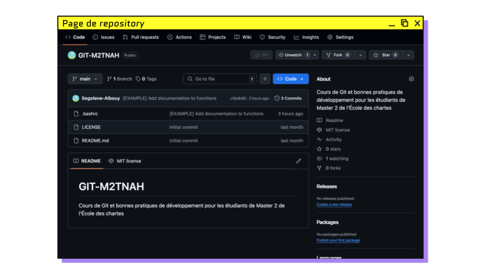
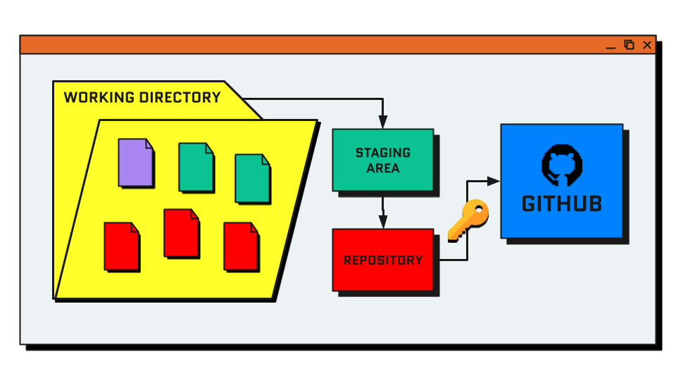
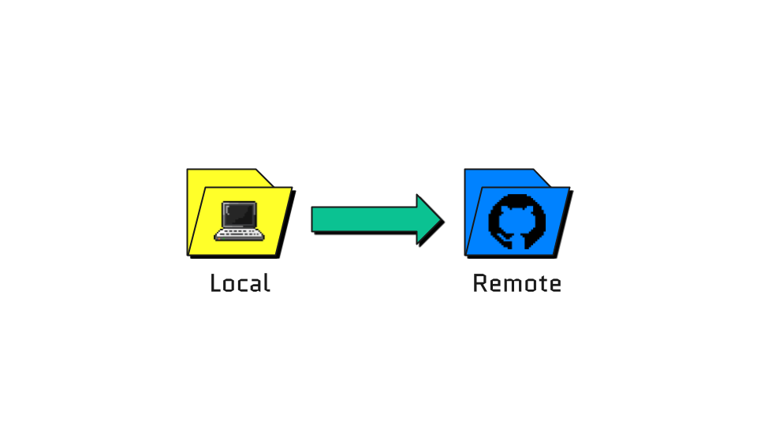
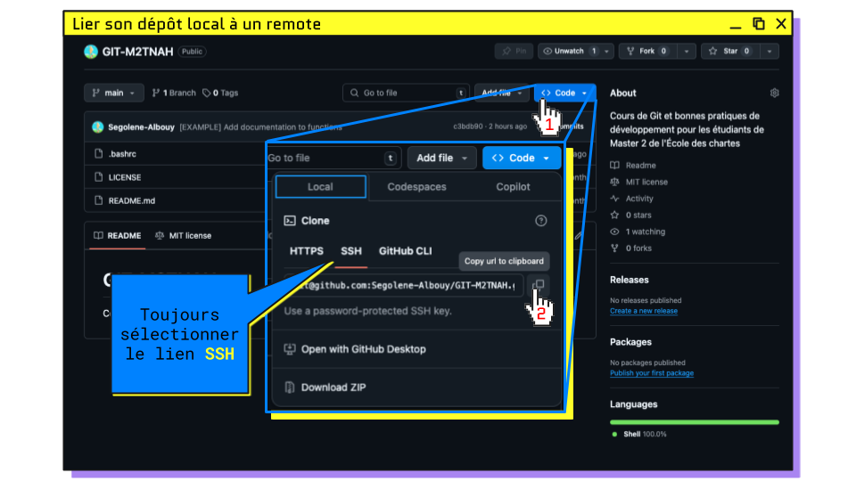
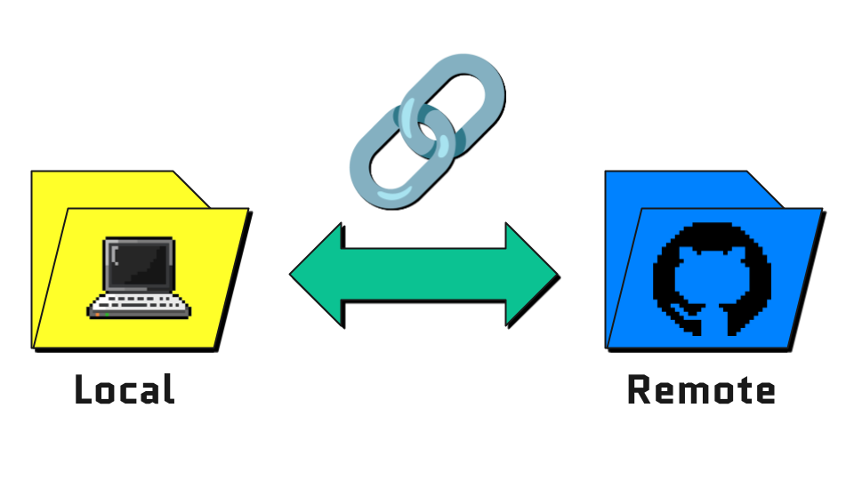
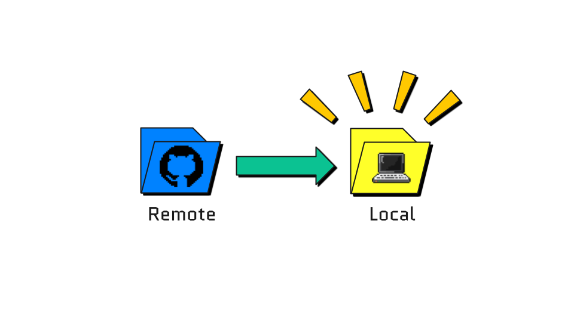
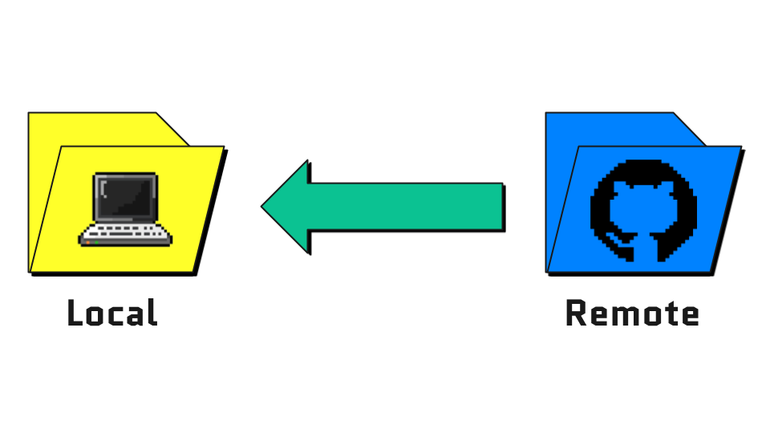
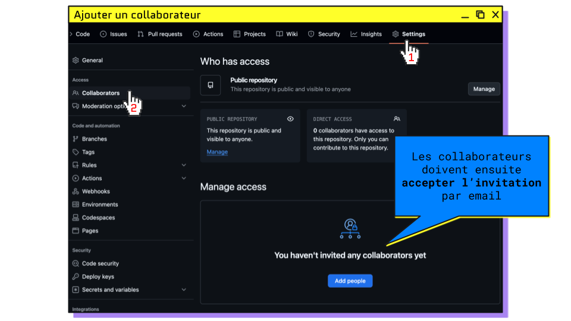

## GitHub

Il existe différents services en ligne pour héberger ses _repositories_ :

- [GitHub](https://github.com) : option la plus répandue, sert de portfolio aux développeurs
- [GitLab](https://gitlab.com/) : très utilisé en entreprise, peut être hébergé sur des serveurs privés
- [Bitbucket](https://bitbucket.org) : version développée par Atlassian

<hr>

### Obtenir une licence étudiante GitHub

> #### Prérequis
> 1. Ajouter son adresse mail de l’École : [github.com/settings/emails](https://github.com/settings/emails)
> 2. Remplir son profil GitHub : [github.com/settings/profile](https://github.com/settings/profile)
> 3. Customiser son README : [github.com/<your-username>](https://github.com/<your-username>)
> 4. Renseigner ses infos bancaires : [github.com/settings/billing/payment_information](https://github.com/settings/billing/payment_information)
> 5. Activer la 2 factors Authentication 
>    - Par [SMS](https://docs.github.com/fr/authentication/securing-your-account-with-two-factor-authentication-2fa/configuring-two-factor-authentication#configuring-two-factor-authentication-using-text-messages) 
>    - Puis avec l’[app mobile](https://docs.github.com/fr/authentication/securing-your-account-with-two-factor-authentication-2fa/configuring-two-factor-authentication#configuration-de-lauthentification-%C3%A0-2facteurs-%C3%A0-laide-de-github-mobile)
> 
> #### Demande de la licence
> 1. Renseigner son institution [education.github.com/discount_requests/application](https://github.com/settings/education/benefits)
> 2. Prendre en photo sa carte étudiant
> 3. Attendre la validation
> 4. Installer le plugin copilot sur son IDE
> 5. Profiter de copilot gratuitement !

### Git vs GitHub

| Git                                                       | GitHub                                                    |
|-----------------------------------------------------------|-----------------------------------------------------------|
| Gestionnaire de versions                                  | Service d’hébergement en ligne                            |
| Outil local sur sa machine pour modifier ses repositories | Là où stocker et publier ses repositories                 |
| Ensemble de commandes disponibles dans le terminal        | Interface web pour visualiser et collaborer sur des repos |

<hr>

#### _Remote / local repository_

| Local                                                  | Remote                                                  |
|--------------------------------------------------------|---------------------------------------------------------|
|   |  |
| Dossier contenant le _repo_ situé sur votre ordinateur | Version en ligne du _repo_, à la manière d’un _drive_   |

Le _remote repository_ est une version du _repository_ (aussi désignée par `origin`) en ligne 
qui permet de centraliser l’historique et les modifications. 
Public ou privé, plusieurs collaborateurs peuvent y contribuer, avec différents droits.

<hr>

#### _Repository_ sur GitHub



Fichiers spéciaux du _repository_ :
- [`.gitignore`](./templates/.gitgnore) : liste des fichiers à ignorer par git
- [`README.md`](./templates/README.md) : documentation du projet, s'affiche sur la page principale du _repository_
- [`LICENSE`](http://choosealicense.com) : licence utilisée pour le code du projet

<hr>

### Processus de publication



<hr>

#### Authentifier son ordinateur pour GitHub

Pour publier du code sur GitHub, il faut configurer une authentification SSH.
Elle repose sur une paire de clés :
- La clé privée (secrète, sur l'ordinateur)
- La clé publique (partagée sur GitHub)

Lors d'envoi de code sur GitHub, l'ordinateur prouve qu'il possède la clé privée 
correspondant à la clé publique dont dispose GitHub.

1. Créer une clef SSH depuis le terminal
   ```bash
   # création de la paire de clefs (appuyer sur Entrée pour les options par défaut)
   ssh-keygen -t ed25519
   # afficher le contenu de la clef publique
   cat ~/.ssh/id_ed25519.pub
   ```
2. GitHub > Settings > SSH and GPG keys > [New](https://github.com/settings/ssh/new)
3. Coller la clef publique affichée dans votre terminal 
4. Nommer la clef pour désigner votre ordinateur

<hr>

#### Publier du code local sur GitHub : `git push`



```bash
git push
```

> **😰 Problème : Aucun dépôt distant !**
> ```bash
> $ git push
> fatal : Pas de destination pour pousser.
> Spécifiez une URL depuis la ligne de commande ou configurez un dépôt distant en utilisant
> 
>     git remote add <origin> <url>
> 
> et poussez alors en utilisant le dépôt distant
> 
>     git push <origin>
> ```

<hr>

#### Créer un _remote repository_ sur GitHub

Créer une nouveau repository sur [GitHub](https://github.com/new) puis copier le lien SSH.



<hr>

#### Lier son _local repository_ au _remote repository_ : `git remote add <url>`



```bash
# Lier son repo local à un repo distant
git remote add origin <url-repo-distant>

# Il est ensuite possible de publier son repo
git push
```

<hr>

#### Copier un _remote repository_ en local : `git clone <url>`



```bash
# Copier un repo distant sur son ordinateur
git clone <url-repo-distant>

# De manière générale, pour créer un nouveau projet, 
# on le crée sur GitHub, puis le clone en local

# Cloner le repository du cours
git clone git@github.com:Segolene-Albouy/GIT-M2TNAH.git
```

<hr>

#### 😭 GitHub veut pas m’autoriser à cloner le _repo_ !

On commence par lire le message de son terminal :

```bash
git@github.com: Permission denied (publickey).
fatal: Could not read from remote repository.

Please make sure you have the correct access rights and the repository exists
```

L'erreur peut être due à :
- **Compte git local mal configuré**
    ```bash
    # Vérifier dans sa config locale que user & email correspondent bien à ceux du compte GitHub
    git config --list
    
    # Si ce n’est pas le cas, corriger avec (⚠️ retirer les chevrons)
    git config --global user.name "<github-user>"
    git config --global user.email "<github-email>"
    ```
- **Clé SSH défectueuse**
    ```bash
    # Vérifier la config SSH avec GitHub
    ssh -T git@github.com
    
    # Afficher le contenu de la clef publique (en recréer une avec `ssh-keygen -t ed25519` si besoin)
    cat ~/.ssh/id_ed25519.pub
    
    # Copier la clef publique et la coller sur GitHub
    ```

<hr>

#### Cloner directement depuis VSCode

1. Ouvrir la Command palette `Ctrl+Shift+P`
2. Rechercher “Git clone” 
3. Connexion à GitHub 
4. Sélection du repository 
5. Choix de l’emplacement 
6. Ajout au Workspace

<hr>

#### Récupérer du code depuis le _repo_ distant : `git pull`



```bash
# récuperer du code depuis GitHub
git pull

# git pull est une forme de fusion de branches puisqu’on réunit le contenu d’une branche distante avec une branche locale

# récuperer du code depuis GitHub sans fusion
git fetch
```

<hr>

#### Ajouter un collaborateur à son _repository_



1. GitHub > Settings > Collaborators > Manage access
2. Les collaborateurs doivent ensuite accepter l’invitation reçue par email

<hr>

### Exercice 4 : Contribuer à plusieurs sur un _repository_ (par 2)

1. Un des deux crée un _repository_ sur GitHub
2. Il ajoute l’autre dans les collaborateurs
3. Chacun clone le _repository_ sur son ordinateur
4. Depuis son IDE, chacun effectue des commits sur la branche **main**
5. Chacun push ses commits sur le _repo_ distant

> _Que se passe-t-il ? Pourquoi ?_

<hr>

#### 😭 L’autre a réussi à _pusher_ mais moi ça marche paaaas !

On commence par lire le message de son terminal :

```bash
To github.com:utilisateur/nom-du-repo.git
 ! [rejected] <local> -> <remote> (fetch first)
error: failed to push some refs to '<remote>'
...
hint: (e.g., 'git pull ...') before pushing again.
```

> Il n’est pas possible de pusher ses modifications sans avoir auparavant intégré les commits déjà publiés sur le _remote_
> Pour mettre à jour sa version du code et pouvoir pusher, il faut d’abord `pull` le dépôt distant
> 
> ```bash
> To <remote> ! [rejected] <b> -> <b> (fetch first)
> error: failed to push some refs to '<remote>'
> ...
> 
> $ git pull
> ```

<hr>

#### 😭 GitHub veut pas m’autoriser à _pusher_ !

On commence par lire le message de son terminal :

```bash
remote: Support for password authentication was removed on August 13, 2021. Please use a personal access token instead.

fatal: Authentication failed for 'https://github.com/username/repo.git/'
```

> Lorsqu’on utilise le lien HTTPS pour cloner un _repository_, il n’est plus possible de publier son code.
> Il faut alors changer le remote pour utiliser **lien SSH** du _repository_
> 
> ```bash
> # Modifier l’URL du remote pour le lien SSH
> git remote set-url origin git@github.com:ssh.git
> ```

<hr>

### Exercice 4 : suite de l'exercice

1. _Pull_ de la branche `main` locale avec les modifs _remote_
2. Chacun crée une branche à partir de main
3. Chacun modifie **les mêmes bouts** de fichiers déjà existants
4. Chacun _push_ sa branche sur le _repo_ distant

> _Que se passe-t-il ? Pourquoi ?_

<hr>

#### Publier une nouvelle branche : `git push -u origin <branch-name>`

Lorsqu’une nouvelle branche est créée en local, il faut configurer une branche distante sur laquelle _pusher_.

```bash
$ git push

fatal : La branche courante <branch> n'a pas de branche amont.

Pour pousser la branche courante et définir la distante comme amont, utilisez

    git push --set-upstream origin <branch>
    
$ git push -u origin <branch>
```

<hr>

### Exercice 4 : fin de l'exercice

1. Récupérer la branche de l’autre en local
2. Changer de branche pour aller sur l’autre
3. Merger sa branche dans celle de l’autre
4. Ouvrir le fichier avec conflit sur l’IDE
5. Modifier le fichier pour ne conserver qu’une version des modifications
6. Finir le merge et publier le code sur GitHub

[Correction](./exercices/exercice4.sh)