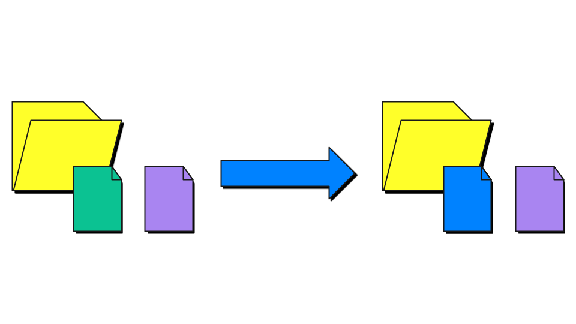
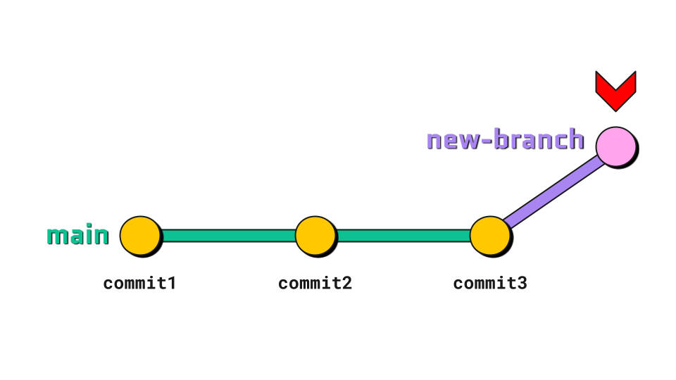
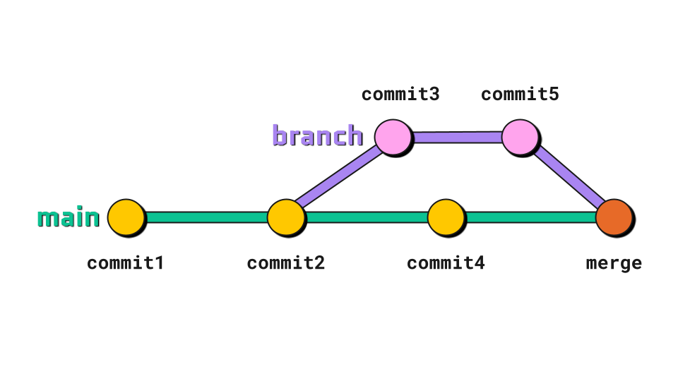

# Cours Git et bonnes pratiques de développement

Ce *repository* constitue un dépôt pour le contenu pédagogique du cours « Git & bonnes pratiques de code » du 
M2 Technologies Numériques Appliquées à l'Histoire à l'École des chartes.

## Programme du cours

| Date        | Horaire     | Sujet                                                                                                                                                                                                            |
|-------------|-------------|------------------------------------------------------------------------------------------------------------------------------------------------------------------------------------------------------------------|
| 7 octobre   | 15h00-17h00 | [Bases de git et environnement de code](https://docs.google.com/presentation/d/e/2PACX-1vRRJo_SUd24189nq2HBysZd9d57d1zRqks2vDCfBzDls6nqOySY3uGVHbR_SQlU3Rc3ibb8W4eV1Ipj/pub?start=false&loop=false&delayms=3000) |
| 14 octobre  | 15h00-17h00 | Développement collaboratif avec GitHub                                                                                                                                                                           |
| 9 décembre  | 15h00-17h00 | Bonnes pratiques et _test driven development_                                                                                                                                                                    |
| 10 décembre | 15h00-17h00 | Méthodologie DevOps et intégration continue                                                                                                                                                                      |

## Ressources en ligne

* [Git - la documentation](https://git-scm.com/doc)
* [Tutoriels Atlassian](https://www.atlassian.com/fr/git/tutorials/what-is-version-control)
* [Guide de survie Git](https://rogerdudler.github.io/git-guide/index.fr.html)
* [Guide du développement open-source](https://opensource.guide/fr/)

## Cheatsheet

| Illustration                      | Commande                                                    | Description                                                                                                                   |
|-----------------------------------|-------------------------------------------------------------|-------------------------------------------------------------------------------------------------------------------------------|
|        | `git init`                                                  | Initialiser un repository                                                                                                     |
|         | `git add <filename>` `git add -A`                        | Ajouter un fichier à la _staging area_ Ajouter tous les fichiers modifiés                                                  |
|      | `git commit -m "<message>"`                                 | Valider les modifications avec un message                                                                                     |
|      | `git branch` `git branch <branch-name>`                  | Lister les branches du repository Créer une nouvelle branche "branch-name"                                                 |
|      | `git switch <branch-name>` `git switch -c <branch-name>` | Basculer sur la branche "branch-name" Créer une nouvelle branche et s'y déplacer                                           |
|       | `git merge <branch-name>`                                   | Fusionner la branche "branch-name" dans la branche courante                                                                   |
|      | `git rebase <branch-name>`                                  | Réécrire les commits de la branche "branch-name" sur la branche courante (⚠️ toujours sur une branche où on travaille seul·e) |
|        | `git push`                                                  | Envoyer les commits sur le _remote repository_                                                                                |
|        | `git pull` `git fetch`                                   | Récupérer les modifications du _remote repository_ Récupérer les modifications sans les fusionner                          |
|       | `git clone <url>`                                           | Cloner un _repository_ distant en local                                                                                       |
|  | `git remote add <repository-url>`                           | Lier son _repository_ local à un remote                                                                                       |
|         | `git log`                                                   | Afficher l'historique des commits                                                                                             |
|                                   | `git status`                                                | Lister les fichiers modifiés/indexés                                                                                          |
|                                   | `git diff`                                                  | Afficher le contenu des différences entre le dernier commit et les fichiers modifiés depuis                                   |
