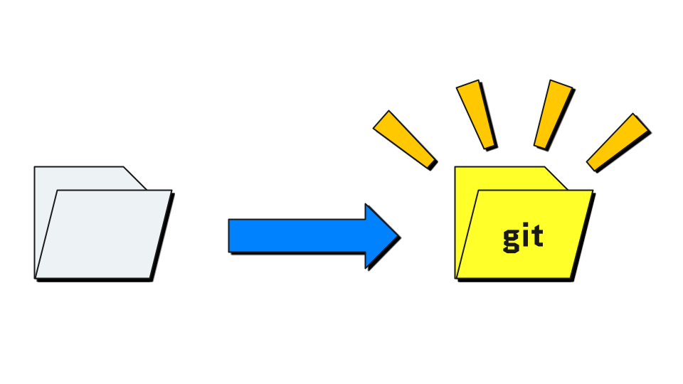
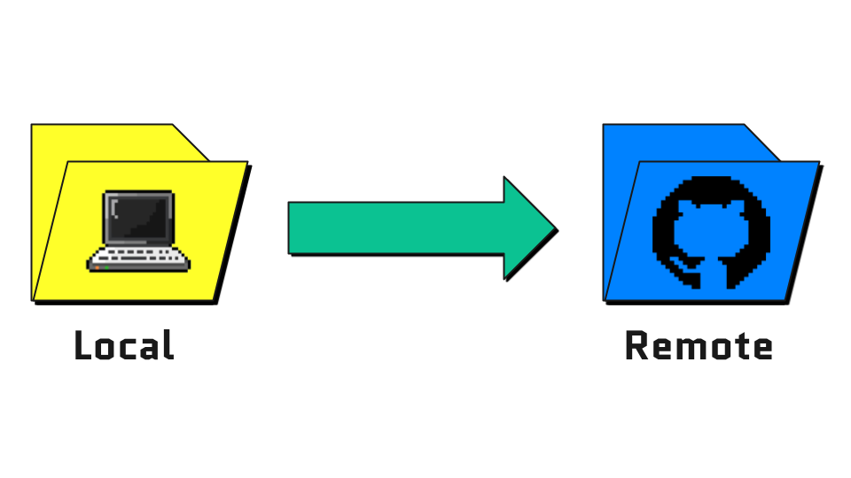
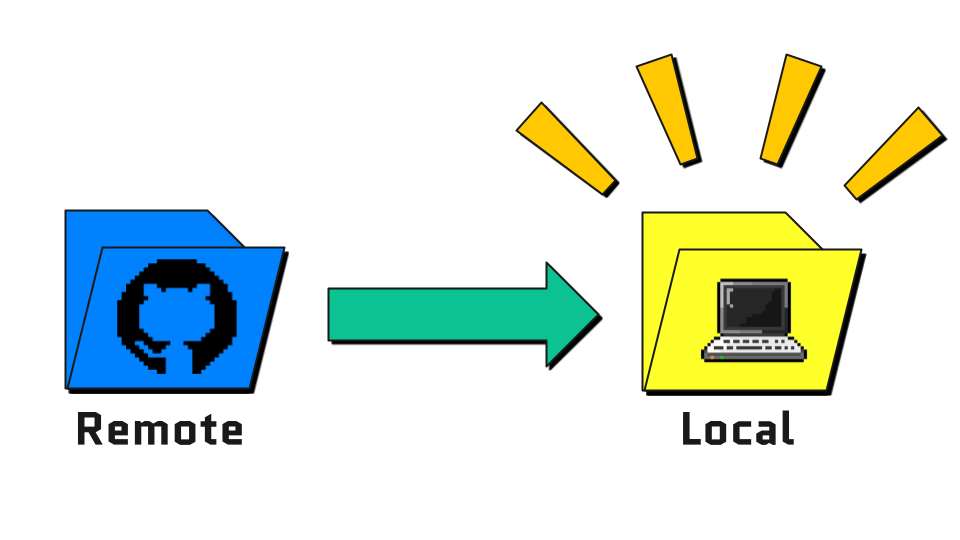

# Cours Git et bonnes pratiques de développement

Ce *repository* constitue un dépôt pour le contenu pédagogique du cours « Git & bonnes pratiques de code » du 
M2 Technologies Numériques Appliquées à l'Histoire à l'École des chartes.

## Programme du cours

| Date        | Horaire     | Sujet                                                                                                                                                                                                            |
|-------------|-------------|------------------------------------------------------------------------------------------------------------------------------------------------------------------------------------------------------------------|
| 7 octobre   | 15h00-17h00 | [Bases de git et environnement de code](https://docs.google.com/presentation/d/e/2PACX-1vRRJo_SUd24189nq2HBysZd9d57d1zRqks2vDCfBzDls6nqOySY3uGVHbR_SQlU3Rc3ibb8W4eV1Ipj/pub?start=false&loop=false&delayms=3000) |
| 14 octobre  | 15h00-17h00 | Développement collaboratif avec GitHub                                                                                                                                                                           |
| 9 décembre  | 15h00-17h00 | Bonnes pratiques et _test driven development_                                                                                                                                                                    |
| 10 décembre | 15h00-17h00 | Méthodologie DevOps et intégration continue                                                                                                                                                                      |

## Ressources en ligne

* [Git - la documentation](https://git-scm.com/doc)
* [GitHub Skills](https://skills.github.com/)
* [GitHub - Documentation](https://guides.github.com/)
* [Guide du développement open-source](https://opensource.guide/fr/)
* [Tutoriels Atlassian](https://www.atlassian.com/fr/git/tutorials/what-is-version-control)
* [Guide de survie Git](https://rogerdudler.github.io/git-guide/index.fr.html)

## Cheatsheet

<table>
    <thead>
        <th>Illustration</th>
        <th>Commande</th>
        <th>Description</th>
    </thead>
<tbody>
    <tr>
        <td></td>
        <td><pre>git init</pre></td>
        <td>Initialiser un <i>repository</i></td>
    </tr>
    <tr>
        <td></td>
        <td><pre>git add &lt;filename&gt;</pre>
<pre>git add -A</pre></td>
        <td>Ajouter un fichier à la <i>staging area</i>
Ajouter tous les fichiers modifiés</td>
    </tr>
    <tr>
        <td></td>
        <td><pre>git commit -m "&lt;message&gt;"</pre></td>
        <td>Valider les modifications avec un message</td>
    </tr>
    <tr>
        <td></td>
        <td><pre>git branch</pre>
<pre>git branch &lt;branch-name&gt;</pre></td>
        <td>Lister les branches du repository
Créer une nouvelle branche <code>branch-name</code></td>
    </tr>
    <tr>
        <td></td>
        <td><pre>git switch &lt;branch-name&gt;</pre>
<pre>git switch -c &lt;branch-name&gt;</pre></td>
        <td>Basculer sur la branche <code>branch-name</code>
Créer une nouvelle branche et s'y déplacer</td>
    </tr>
    <tr>
        <td></td>
        <td><pre>git merge &lt;branch-name&gt;</pre></td>
        <td>Fusionner la branche <code>branch-name</code> dans la branche courante</td>
    </tr>
    <tr>
        <td></td>
        <td><pre>git rebase &lt;branch-name&gt;</pre></td>
        <td>Réécrire les commits de la branche <code>branch-name</code> sur la branche courante (⚠️ toujours sur une branche où on travaille seul·e)</td>
    </tr>
    <tr>
        <td></td>
        <td><pre>git push</pre></td>
        <td>Envoyer les commits sur le <i>remote repository</i></td>
    </tr>
    <tr>
        <td></td>
        <td><pre>git pull</pre>
<pre>git fetch</pre></td>
        <td>Récupérer les modifications du <i>remote repository</i>
Récupérer les modifications sans les fusionner</td>
    </tr>
    <tr>
        <td></td>
        <td><pre>git clone &lt;url&gt;</pre></td>
        <td>Cloner un <i>repository</i> distant en local</td>
    </tr>
    <tr>
        <td></td>
        <td><pre>git remote add &lt;repo-url&gt;</pre></td>
        <td>Lier son <i>repository</i> local à un remote</td>
    </tr>
    <tr>
        <td></td>
        <td><pre>git log</pre></td>
        <td>Afficher l'historique des commits</td>
    </tr>
    <tr>
        <td></td>
        <td><pre>git status</pre></td>
        <td>Lister les fichiers modifiés/indexés</td>
    </tr>
    <tr>
        <td></td>
        <td><pre>git diff</pre></td>
        <td>Afficher le contenu des différences entre le dernier commit et les fichiers modifiés depuis le dernier commit</td>
    </tr>
</tbody>
</table>
